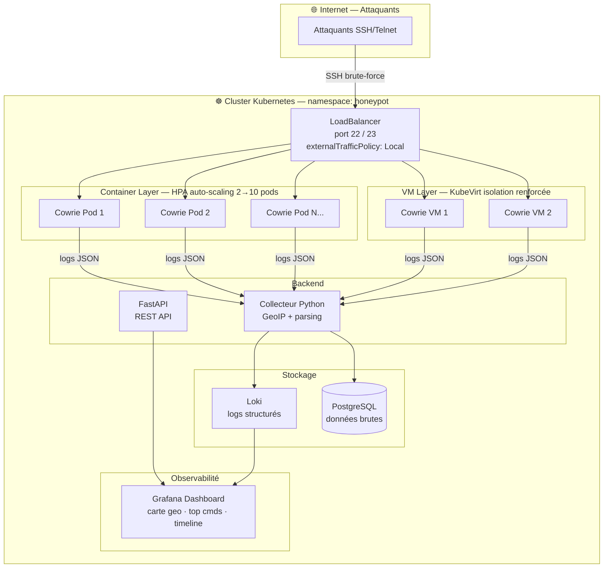

# 🍯 Honeypot as a Service

[](https://github.com/mizaaah/Honeypot/actions)
[](https://kubernetes.io)
[](https://python.org)
[](LICENSE)

Déploiement de honeypots SSH **Cowrie** en haute disponibilité dans Kubernetes, avec collecte de logs enrichis, dashboard Grafana temps réel et API FastAPI.

---

## Architecture



---

## Stack technique

| Composant | Technologie |
|-----------|-------------|
| Honeypot SSH | Cowrie |
| Orchestration | Kubernetes (k3s) + KubeVirt |
| Auto-scaling | HPA (Horizontal Pod Autoscaler) |
| Backend collecteur | Python 3.12 |
| API | FastAPI |
| Dashboard | Grafana |
| Logs | Loki |
| CI/CD | GitHub Actions + Trivy |
| Sécurité | CIS Benchmark + ANSSI |

---

## Structure du projet

```
Honeypot/
├── .github/
│   ├── workflows/
│   │   └── ci.yml              # Pipeline CI/CD avec Trivy scan
│   └── dependabot.yml          # Gestion des dépendances
├── .pre-commit-config.yaml     # Hooks pre-commit (Black, Flake8)
├── api/                        # FastAPI — REST API pour données + dashboards
│   └── README.md
├── backend/                    # Collecteur Python — parse logs JSON Cowrie
│   ├── collecteur.py           # Main collector (GeoIP, enrichissement)
│   ├── collector.py            # Alternative collector
│   └── requirements.txt        # Dépendances Python
├── cowrie/                     # Config SSH Honeypot Cowrie
│   ├── docker-compose.yml      # Déploiement local Cowrie
│   ├── cowrie.cfg              # Configuration Cowrie
│   ├── Dockerfile              # Image Docker Cowrie
│   └── README.md
├── grafana/                    # Dashboards Grafana temps réel
│   ├── dashboards/             # JSON dashboards
│   ├── datasources/            # Connexions Loki/PostgreSQL
│   └── README.md
├── hardening/
│   └── hardening-nodes.sh      # Script hardening Linux CIS Benchmark + ANSSI
├── k8s/                        # Manifests Kubernetes complets
│   ├── namespace.yaml          # Namespace honeypot (isolation réseau)
│   ├── network-policies.yaml   # NetworkPolicy — filtrage trafic
│   ├── cowrie/
│   │   ├── deployment.yaml     # Deployment Cowrie + SecurityContext
│   │   ├── configmap.yaml      # ConfigMap cowrie.cfg
│   │   ├── hpa.yaml            # HPA auto-scaling 2→10 pods
│   │   └── service.yaml        # LoadBalancer SSH/Telnet (port 22, 23)
│   ├── collector/              # Backend Python collecteur
│   │   ├── deployment.yaml
│   │   └── service.yaml
│   ├── api/                    # FastAPI
│   │   ├── deployment.yaml     # API replicas x2, HPA
│   │   ├── hpa.yaml            # Auto-scaling CPU/Memory
│   │   └── service.yaml        # ClusterIP service
│   └── kubevirt/
│       └── cowrie-vm.yaml      # VM Layer — isolation hyperviseur KubeVirt
├── scripts/                    # Utilitaires et outils
├── .pre-commit-config.yaml     # Black + Flake8 hooks
└── README.md
```

---

## Infrastructure & Kubernetes

### Namespace et isolation réseau

Tous les composants tournent dans le namespace dédié `honeypot`. Les **NetworkPolicy** isolent chaque composant :
- Cowrie ne peut envoyer des données qu'au collecteur Python
- Aucun accès au reste du cluster
- L'IP source des attaquants est conservée grâce à `externalTrafficPolicy: Local`

### SecurityContext — durcissement des pods

Chaque pod Cowrie tourne avec :
- `runAsNonRoot: true` — pas de root dans les containers
- `readOnlyRootFilesystem: true` — filesystem en lecture seule
- `allowPrivilegeEscalation: false` — pas d'escalade de privilèges
- `capabilities: drop: [ALL]` — aucune capability Linux
- `automountServiceAccountToken: false` — pas d'accès à l'API K8s
- `seccompProfile: RuntimeDefault` — filtre des appels système

### HPA — Auto-scaling

Le HPA scale automatiquement entre **2 et 10 replicas** selon la charge CPU (>60%) et mémoire (>70%), avec un scale-up rapide (30s) et un scale-down prudent (5min).

### VM Layer — KubeVirt

En complément des pods (légers, scalables), un layer de VMs KubeVirt offre une isolation renforcée au niveau hyperviseur, résistante aux tentatives d'évasion de container.

---

## Hardening des nodes

Le script `hardening/hardening-nodes.sh` applique les recommandations **CIS Benchmark** et **ANSSI** sur chaque node Kubernetes :

- Désactivation de la connexion root SSH
- Configuration de **auditd** (journalisation des appels système)
- **fail2ban** sur le port SSH du node
- Paramètres **sysctl** de durcissement réseau et kernel
- Désactivation des services inutiles
- Permissions fichiers critiques

```bash
sudo bash hardening/hardening-nodes.sh
```

---

## Composants clés

### 🔍 Backend — Collecteur Python

Le collecteur récupère les logs JSON de Cowrie, les enrichit avec GeoIP et les stocke :

```bash
cd backend
pip install -r requirements.txt
python collecteur.py
```

**Fonctionnalités** :
- Parse logs JSON de Cowrie (format JSONLines)
- Enrichissement GeoIP (localisation attaquants)
- Stockage PostgreSQL et Loki
- Thread-safe et scalable

### 🌐 API — FastAPI

REST API pour :
- Requêtes SQL sur les logs
- Webhooks pour alertes
- Exposed via `https://api.honeypot.local`

```bash
cd api
pip install fastapi uvicorn
uvicorn main:app --reload
```

Les manifests K8s déploient l'API en **2 replicas** avec **HPA**.

### 🖼️ Grafana Dashboards

Dashboards temps réel visualisant :
- **Carte géographique** des attaques (GeoIP)
- **Top 10 commands** tentés
- **Timeline** attaques
- **Logs streams** Loki

Configuration datasources : voir `grafana/datasources/`

### 🛡️ Cowrie Configuration

Configuration Cowrie : `cowrie/cowrie.cfg`
- Ports SSH/Telnet (22, 23) disponibles
- Logs JSON structurés
- Intégration backend collecteur

**Déploiement local** :
```bash
cd cowrie
docker-compose up -d
```

---

## Déploiement

### Déploiement complet K8s

```bash
# 1. Cloner le repo
git clone https://github.com/mizaaah/Honeypot.git
cd Honeypot

# 2. Créer le namespace
kubectl apply -f k8s/namespace.yaml

# 3. Déployer Cowrie + collecteur + API
kubectl apply -f k8s/

# 4. Vérifier tous les composants
kubectl get all -n honeypot
kubectl get hpa -n honeypot

# 5. Voir les logs du collecteur
kubectl logs -n honeypot -l app=honeypot-collector -f

# 6. Voir les logs de l'API
kubectl logs -n honeypot -l app=honeypot-api -f
```

### Vérification rapide

```bash
# SSH vers honeypot (ports redirigés au LoadBalancer)
ssh -p 22 root@honeypot.local

# Vérifier auto-scaling
kubectl get hpa -n honeypot -w

# Vérifier NetworkPolicy appliquées
kubectl get networkpolicies -n honeypot
```

### Hardening des nodes

Pour durcir les nodes Kubernetes selon **CIS Benchmark** et **ANSSI** :

```bash
# Sur chaque node physique
sudo bash hardening/hardening-nodes.sh
```

---

## CI/CD — GitHub Actions

Le pipeline `.github/workflows/ci.yml` :
- 🔍 **Trivy scan** — détecte vulnérabilités image Docker
- ✅ **Linters** — Black (Python format), Flake8 (style)
- 📦 **Build Docker** — images Cowrie, API, collecteur
- 🚀 **Push registre** — si tag release

Trigger automatique sur :
- Push sur `main`
- Pull requests
- Tags release

---

## Sécurité

### Pre-commit Hooks

Avant chaque commit, les hooks appliquent :
- **Black** — formatage Python automatique
- **Flake8** — détection erreurs de style

Installation :
```bash
pip install pre-commit
pre-commit install
```

### SecurityContext Pods

Chaque pod Cowrie / API / collecteur applique :
```yaml
securityContext:
  runAsNonRoot: true                    # Pas de root
  readOnlyRootFilesystem: true          # FS en lecture seule
  allowPrivilegeEscalation: false       # Pas d'escalade
  capabilities:
    drop: [ALL]                         # Zéro capabilities
  seccompProfile:
    type: RuntimeDefault                # Appels sys filtrés
automountServiceAccountToken: false     # Pas d'accès API K8s
```

### NetworkPolicy — Isolation réseau

Chaque pod ne peut communiquer qu'avec :
- Son propre namespace honeypot
- Entrée : uniquement SSH/Telnet externe
- Sortie : Cowrie → collecteur → Loki/PostgreSQL/API

---

## Monitoring & Logs

### Loki — Logs structurés

Tous les logs JSON de Cowrie sont indexés dans **Loki** :
```bash
kubectl logs -n honeypot -l app=honeypot-cowrie --tail=100
```

### HPA — Auto-scaling

```bash
# Voir l'état du HPA en temps réel
kubectl get hpa -n honeypot -w

# Cowrie : scale 2-10 pods selon CPU/Memory
# API    : scale 1-5 replicas selon charge
```

---

## Développement local

### Architecture locale (Docker Compose)

```bash
cd cowrie
docker-compose up -d

# Accès Cowrie
ssh -p 2222 root@localhost
```

### Tests backend

```bash
cd backend
python -m pytest tests/ -v
```

### Logs JSON test

Fichier de test : `backend/teste-log-co-ssh.json`
```bash
python collecteur.py < teste-log-co-ssh.json
```

---

> *"Security is not a product, but a process."* — Bruce Schneier

---

## Contribuer

1. Fork le repo
2. Créer une branche : `git checkout -b feature/mon-feature`
3. Commit avec message clair (pré-commit hooks appliqués)
4. Push et créer une PR
5. Pipeline CI/CD + review = merge ✅

**Guidelines** :
- Respecter Black/Flake8 (pré-commit)
- Ajouter tests pour new features
- Documenter changements dans README

---

## FAQ

### Q: Cowrie peut-il escalader ?
**R:** Oui, via **HPA** (2-10 pods) + **KubeVirt** (VM layer séparé).

### Q: Comment protéger l'API en production ?
**R:** NetworkPolicy + TLS (cert-manager) + WAF (ModSecurity).

### Q: Les logs Cowrie sont-ils cryptés en transit ?
**R:** Non actuellement. À améliorer : TLS Loki + encryption at rest.

### Q: Quel coût infra ?
**R:** Dépend cluster K8s : minimum 2 nodes (4CPU, 8GB RAM). K3s ≈ free.

### Q: Comment ajouter alertes ?
**R:** Via API webhooks ou Grafana Alerting Manager (voir `grafana/alerts/`).

---

## Roadmap

- [ ] Support **TLS/mTLS** pour logs Loki
- [ ] **Splunk/Elastic** intégration alternative logs
- [ ] **IDS Suricata** couche réseau
- [ ] **Dashboard Prometheus** CPU/memory cluster
- [ ] Support **GitOps** (ArgoCD)
- [ ] **Terraform** modules pour auto-déploiement

---

## Support & Issues

Ouvrir une issue GitHub ou discuter en discussions.

---

## License

MIT — voir `LICENSE`
