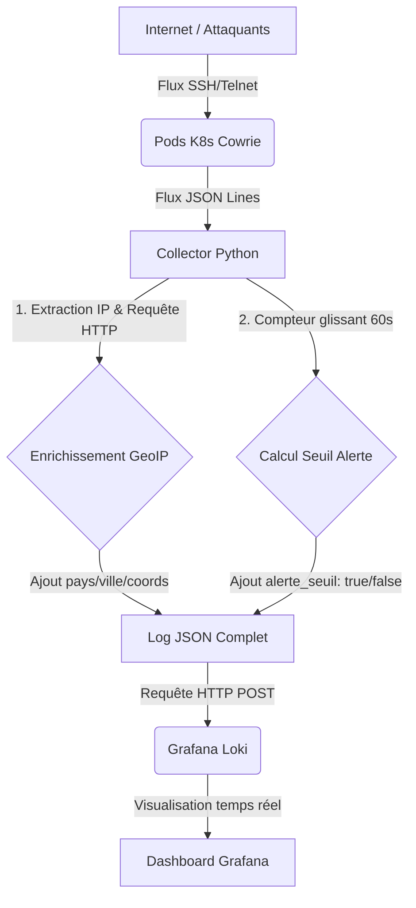

# 🍯 Honeypot as a Service

<div align="center">

[](https://github.com/mizaaah/Honeypot/actions)
[](https://k3s.io)
[](https://python.org)
[](https://github.com/cowrie/cowrie)
[](https://grafana.com)
[](LICENSE)

**Déploiement de honeypots SSH/Telnet en haute disponibilité sur Kubernetes**
Collecte de logs enrichis · Dashboard Grafana temps réel · API FastAPI · Hardening CIS/ANSSI

</div>

---

## 📐 Architecture

```
                        ╔══════════════════════════════╗
                        ║  🌐 Internet — Attaquants    ║
                        ║  SSH brute-force · Malware   ║
                        ╚══════════════╤═══════════════╝
                                       │
                                       ▼
╔══════════════════════════════════════════════════════════════════════════╗
║               ☸️  Cluster k3s  —  namespace: honeypot			           ║
║                                                                          ║
║  ╔════════════════════════════════════════════════════════════════════╗  ║
║  ║           🪤  Layer Honeypot  (HPA: 1 → 10 pods)			        ║  ║
║  ║                                                                    ║  ║
║  ║   ┌─────────────┐    ┌─────────────┐    ┌─────────────┐            ║  ║
║  ║   │ Cowrie Pod  │    │ Cowrie Pod  │    │ Cowrie Pod  │  · · ·     ║  ║
║  ║   │  port 2222  │    │  port 2222  │    │  port 2222  │            ║  ║
║  ║   └──────┬──────┘    └──────┬──────┘    └──────┬──────┘            ║  ║
║  ╚══════════╪═════════════════╪═════════════════╪═════════════════════╝  ║
║             │   logs JSON     │                 │                        ║
║             └─────────────────┼─────────────────┘                        ║
║                               ▼                                          ║
║  ╔════════════════════════════════════════════════════════════════════╗  ║
║  ║              🔄  Backend  —  Collecteur Python					║  ║
║  ║        Parse logs JSON · Enrichissement GeoIP · Threading          ║  ║
║  ╚═══════════════════════╤══════════════════════╤═════════════════════╝  ║
║                          │                      │                        ║
║              ┌───────────▼──────┐   ┌───────────▼──────┐                 ║
║              │   📊  Loki       │   │  🗄️  PostgreSQL │                 ║
║              │  logs structurés │   │  données brutes  │                 ║
║              └───────────┬──────┘   └───────────┬──────┘                 ║
║                          │                      │                        ║
║              ┌───────────▼──────────────────────▼───────┐                ║
║              │            🌐  FastAPI				     │                ║
║              │    REST API · Webhooks · Alertes         │                ║
║              └─────────────────────┬────────────────────┘                ║
║                                    │                                     ║
║              ┌─────────────────────▼────────────────────┐                ║
║              │         📈  Grafana Dashboard		     │                ║
║              │ Carte géo · Top cmds · Timeline · Alertes│                ║
║              └──────────────────────────────────────────┘                ║
║                                                                          ║
║  ╔════════════════════════════════════════════════════════════════════╗  ║
║  ║  🖥️  Infrastructure ESXi + k3s								║  ║
║  ║                                                                    ║  ║
║  ║  k3s-master   192.168.240.247   control-plane                      ║  ║
║  ║  k3s-worker-1 192.168.240.196   Cowrie pods (nested virt)          ║  ║
║  ║  k3s-worker-2 192.168.240.253   Backend + Grafana                  ║  ║
║  ╚════════════════════════════════════════════════════════════════════╝  ║
╚══════════════════════════════════════════════════════════════════════════╝
```

---

## 🛠️ Stack technique

| Composant | Technologie | Rôle |
|-----------|-------------|------|
| 🪤 Honeypot SSH/Telnet | [Cowrie](https://github.com/cowrie/cowrie) | Simulation système vulnérable, capture des attaques |
| ☸️ Orchestration | k3s v1.35 + KubeVirt | Déploiement, scaling, isolation des pods |
| 📈 Auto-scaling | HPA (Horizontal Pod Autoscaler) | Scale 1 → 10 pods selon charge CPU/mémoire |
| 🔄 Collecteur | Python 3.12 | Parse logs JSON, enrichissement GeoIP |
| 🌐 API | FastAPI | REST API, webhooks, données Grafana |
| 📊 Dashboard | Grafana + Loki | Visualisation temps réel, alertes |
| 🔐 Sécurité infra | CIS Benchmark + ANSSI | Hardening des nodes Kubernetes |
| 🚀 CI/CD | GitHub Actions + Trivy | Build, scan vulnérabilités, push images GHCR |

---

## 📁 Structure du projet

```
Honeypot/
├── .github/
│   └── workflows/
│       └── ci.yml              # Pipeline CI/CD — Build, Trivy scan, Push GHCR
├── api/                        # FastAPI — REST API données + dashboards
│   ├── main.py
│   ├── requirements.txt
│   └── Dockerfile
├── backend/                    # Collecteur Python — parse logs JSON Cowrie
│   ├── collecteur.py           # Collecteur principal (GeoIP, enrichissement)
│   ├── requirements.txt
│   └── Dockerfile
├── cowrie/                     # Honeypot SSH/Telnet Cowrie
│   ├── Dockerfile              # Image Docker → ghcr.io/mizaaah/cowrie:latest
│   ├── cowrie.cfg              # Config Cowrie (ports, logs JSON, hostname)
│   └── docker-compose.yml      # Déploiement local pour tests
├── grafana/                    # Dashboards Grafana temps réel
│   ├── dashboards/             # JSON dashboards (carte géo, top cmds, timeline)
│   └── datasources/            # Connexions Loki / PostgreSQL
├── hardening/
│   └── hardening-nodes.sh      # Hardening Linux — CIS Benchmark + ANSSI
├── k8s/                        # Manifests Kubernetes
│   ├── namespace.yaml          # Namespace honeypot
│   ├── network-policies.yaml   # NetworkPolicy — isolation réseau
│   ├── api/
│   │   ├── deployment.yaml
│   │   ├── hpa.yaml
│   │   └── service.yaml
│   └── kubevirt/
│       └── cowrie-vm.yaml      # Deployment Cowrie via image GHCR
└── README.md
```

---

## 🚀 Déploiement

### Prérequis

- Cluster k3s opérationnel (3 nodes minimum)
- `kubectl` configuré : `export KUBECONFIG=/etc/rancher/k3s/k3s.yaml`
- Accès à `ghcr.io/mizaaah/cowrie:latest` (image CI/CD)

### Déploiement complet

```bash
# 1. Cloner le repo
git clone https://github.com/mizaaah/Honeypot.git
cd Honeypot

# 2. Créer le namespace
kubectl apply -f k8s/namespace.yaml

# 3. Déployer Cowrie
kubectl apply -f k8s/kubevirt/cowrie-vm.yaml

# 4. Vérifier tous les composants
kubectl get all -n honeypot

# 5. Récupérer le port exposé
kubectl get svc -n honeypot
```

### Vérification rapide

```bash
# Statut du cluster
kubectl get nodes

# Pods Cowrie
kubectl get pods -n honeypot

# Logs en temps réel
kubectl logs -n honeypot deployment/cowrie -f

# Test connexion honeypot (remplacer PORT par le NodePort)
ssh root@<WORKER_IP> -p <NODEPORT>
```

---

## 🔐 Hardening des nodes

Le script `hardening/hardening-nodes.sh` applique les recommandations **CIS Benchmark** et **ANSSI** sur chaque node.

### Ce qui est appliqué

| Catégorie | Mesure |
|-----------|--------|
| SSH | Désactivation root, auth par clé uniquement, MaxAuthTries=3, banner légal |
| Kernel | sysctl — protection SYN flood, ICMP, martians, ASLR, kptr_restrict |
| Audit | auditd — journalisation connexions, execve, sudo, modifications /etc |
| Brute-force | fail2ban — ban 24h après 3 échecs SSH (LAN ignoré) |
| Services | Désactivation bluetooth, avahi, cups, postfix, rpcbind |
| Fichiers | chmod 000 /etc/shadow, chmod 600 /etc/ssh/sshd_config |
| Core dumps | Désactivés via limits.conf + ulimit |

```bash
# Lancer sur chaque node (master + workers)
sudo bash hardening/hardening-nodes.sh

# Vérifier les règles auditd
auditctl -l

# Vérifier fail2ban
sudo fail2ban-client status sshd
```

> ⚠️ **Important** : Configurer les clés SSH avant de lancer le script (`PasswordAuthentication` sera désactivé).

---

## 🪤 Cowrie — Honeypot SSH

Cowrie simule un faux serveur Linux vulnérable. L'attaquant croit interagir avec un vrai système.

### Ce que Cowrie capture

- Toutes les commandes tapées par l'attaquant
- Tentatives de téléchargement de malware (`wget`, `curl`)
- Credentials utilisés (login / password)
- Empreinte du client SSH
- Durée et timeline complète de la session

### Logs JSON

```json
{
  "eventid": "cowrie.login.failed",
  "username": "root",
  "password": "123456",
  "src_ip": "185.x.x.x",
  "timestamp": "2026-06-17T10:00:00Z"
}
```

### Configuration

```ini
[honeypot]
hostname = server01
listen_endpoints = tcp:2222:interface=0.0.0.0

[output_jsonlog]
enabled = true
logfile = var/log/cowrie/cowrie.json
```

---

## 🔄 Pipeline de Données & Enrichissement

Le collecteur Python (situé dans `/backend`) agit comme le processeur central des événements du Honeypot. Contrairement aux architectures de transfert brut, ce composant applique une logique métier et de sécurité sur le flux en temps réel.

### 📐 Flux du collecteur (Mermaid)



### ✨ Fonctionnalités implémentées

- **Streaming Multi-thread K8s :** Le script interroge l'API Kubernetes toutes les 30 secondes pour détecter dynamiquement les nouveaux pods Cowrie actifs et instancie un thread d'écoute (`threading.Thread`) isolé pour chacun d'eux, sécurisé par un mécanisme de verrouillage (`threading.Lock`).
- **Enrichissement GeoIP :** Extraction et géolocalisation en temps réel via l'API `ip-api.com` (Pays, Ville, Latitude, Longitude) pour alimenter la cartographie Grafana de Sébastien.
- **Calculateur d'Alertes :** Analyse comportementale basée sur un compteur glissant d'une minute. En cas de dépassement du seuil critique (100 tentatives/min), le tag `"alerte_seuil": true` est injecté directement dans le dictionnaire JSON envoyé à Loki.
- **Gestion "Stateless" des Logs :** Le pipeline applique une politique stricte de non-persistance locale. Aucun log n'est écrit sur le disque du collecteur pour éviter les dénis de service par saturation. La rotation est déléguée aux agents Kubernetes et la rétention à la base Loki.
- **Tests Unitaires :** Intégration de tests automatisés via `pytest` (`test_collector.py`) validant la robustesse du calcul des alertes et de la connectivité GeoIP.

---

## 📊 Observabilité

### Grafana Dashboard

| Dashboard | Contenu |
|-----------|---------|
| 🗺️ Carte géographique | Localisation des attaquants via GeoIP |
| 🔝 Top commandes | Top 10 des commandes les plus utilisées |
| 📅 Timeline | Volume d'attaques par heure / jour |
| 🔑 Credentials | Top logins et passwords tentés |
| 🚨 Alertes | Seuil > 100 tentatives/min |

### Loki — Requêtes LogQL

```logql
# Toutes les connexions réussies
{app="cowrie"} |= "login.success"

# Top IPs attaquantes
{app="cowrie"} | json | line_format "{{.src_ip}}"

# Commandes exécutées
{app="cowrie"} |= "cowrie.command.input"
```

---
## 🐳 Containerisation Cowrie

[ Dockerfile ]                  ← recette de construction

FROM cowrie/cowrie:latest       image officielle Docker Hub

EXPOSE 2222                     port d'écoute SSH
[ cowrie.cfg ]                  ← configuration du honeypot

hostname = server01             faux nom de serveur

listen_endpoints = 0.0.0.0      écoute sur toutes les interfaces

output_jsonlog = true           logs structurés en JSON
[ docker run ]                  ← lancement

-p 2222:2222                    exposition du port

cowrie/cowrie:latest            image utilisée

---

## 🔧 Qualité de code

[ pre-commit ]      hook git automatique avant chaque commit

[ Black  ]          formatage Python — PEP8

[ Flake8 ]          lint — bonnes pratiques

## 🔄 CI/CD — GitHub Actions

```
Push (main/dev)
      │
      ▼
┌─────────────┐
│ Lint & Test │  ruff + pytest + coverage
└──────┬──────┘
       │
       ├──────────────────┬──────────────────┐
       ▼                  ▼                  ▼
┌────────────┐    ┌────────────┐    ┌────────────┐
│   Cowrie   │    │ Collector  │    │    API     │
│   Build    │    │   Build    │    │   Build    │
│ Trivy Scan │    │ Trivy Scan │    │ Trivy Scan │
│  Push GHCR │    │  Push GHCR │    │  Push GHCR │
└────────────┘    └────────────┘    └────────────┘
       │
       ▼
GitHub Security (SARIF upload)
```

---

## 🛡️ Sécurité Kubernetes

### SecurityContext des pods

```yaml
securityContext:
  runAsNonRoot: true                 # Pas de root dans les containers
  readOnlyRootFilesystem: true       # Filesystem en lecture seule
  allowPrivilegeEscalation: false    # Pas d'escalade de privilèges
  capabilities:
    drop: [ALL]                      # Zéro capabilities Linux
  seccompProfile:
    type: RuntimeDefault             # Filtrage des appels système
automountServiceAccountToken: false  # Pas d'accès à l'API K8s
```

### Flux réseau (NetworkPolicy)

```
Internet ──SSH/Telnet──► Cowrie pods ──logs JSON──► Collecteur ──► Loki
                                                               ──► PostgreSQL
                                                               ──► API ──► Grafana
```

Aucune communication non autorisée entre pods. IP source préservée via `externalTrafficPolicy: Local`.

---

## 💻 Développement local

```bash
# Lancer Cowrie en local (Docker)
cd cowrie
docker-compose up -d
ssh root@localhost -p 2222     # test connexion honeypot

# Backend collecteur
cd backend
pip install -r requirements.txt
python collecteur.py

# API FastAPI
cd api
pip install -r requirements.txt
uvicorn main:app --reload      # disponible sur http://localhost:8000
```

---

## 👥 Équipe

| Membre | Rôle | Responsabilités |
|--------|------|-----------------|
| **Enzo** | 🏗️ Architecte / DevOps Lead | Cluster k3s, ESXi, KubeVirt, Hardening CIS/ANSSI |
| **Joris** | 🐍 Backend Python / Data Pipeline | Collecteur Python, GeoIP, Loki, PostgreSQL |
| **Sébastien** | 🌐 FastAPI & Grafana | REST API, dashboards Grafana, alerting rules |
| **Lili** | 🐳 Containerisation & Git Flow | Dockerfile Cowrie, CI/CD GitHub Actions, GHCR |

---

## 📄 License

MIT — voir [`LICENSE`](LICENSE)

---

<div align="center">

*"Security is not a product, but a process."* — Bruce Schneier

</div>
