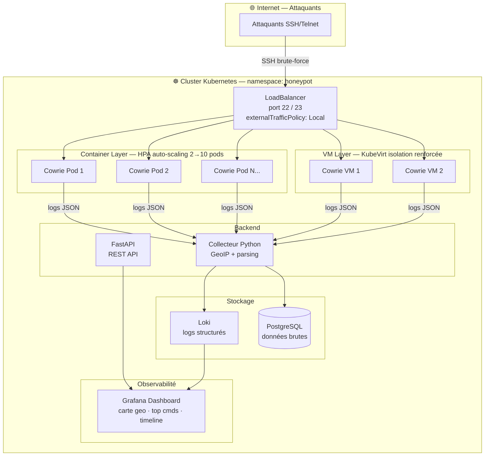

# 🍯 Honeypot as a Service

[](https://github.com/mizaaah/Honeypot/actions)
[](https://kubernetes.io)
[](https://python.org)
[](LICENSE)

Déploiement de honeypots SSH **Cowrie** en haute disponibilité dans Kubernetes, avec collecte de logs enrichis, dashboard Grafana temps réel et API FastAPI.

---

## Architecture



---

## Stack technique

| Composant | Technologie |
|-----------|-------------|
| Honeypot SSH | Cowrie |
| Orchestration | Kubernetes (k3s) + KubeVirt |
| Auto-scaling | HPA (Horizontal Pod Autoscaler) |
| Backend collecteur | Python 3.12 |
| API | FastAPI |
| Dashboard | Grafana |
| Logs | Loki |
| CI/CD | GitHub Actions + Trivy |
| Sécurité | CIS Benchmark + ANSSI |

---

## Structure du projet

```
Honeypot/
├── .github/
│   └── workflows/
│       └── ci.yml              # Pipeline CI/CD
├── api/                        # FastAPI
├── backend/                    # Collecteur Python + GeoIP
├── cowrie/                     # Config Cowrie SSH
├── grafana/                    # Dashboards Grafana
├── hardening/
│   └── hardening-nodes.sh      # Script hardening Linux CIS/ANSSI
├── k8s/
│   ├── cowrie/
│   │   ├── deployment.yaml     # Deployment sécurisé + SecurityContext
│   │   ├── hpa.yaml            # Auto-scaling 2→10 replicas
│   │   └── service.yaml        # LoadBalancer SSH/Telnet
│   ├── kubevirt/
│   │   └── cowrie-vm.yaml      # VM Layer KubeVirt
│   ├── network-policies.yaml   # Isolation réseau du namespace
│   └── namespace.yaml          # Namespace honeypot
└── README.md
```

---

## Infrastructure & Kubernetes

### Namespace et isolation réseau

Tous les composants tournent dans le namespace dédié `honeypot`. Les **NetworkPolicy** isolent chaque composant :
- Cowrie ne peut envoyer des données qu'au collecteur Python
- Aucun accès au reste du cluster
- L'IP source des attaquants est conservée grâce à `externalTrafficPolicy: Local`

### SecurityContext — durcissement des pods

Chaque pod Cowrie tourne avec :
- `runAsNonRoot: true` — pas de root dans les containers
- `readOnlyRootFilesystem: true` — filesystem en lecture seule
- `allowPrivilegeEscalation: false` — pas d'escalade de privilèges
- `capabilities: drop: [ALL]` — aucune capability Linux
- `automountServiceAccountToken: false` — pas d'accès à l'API K8s
- `seccompProfile: RuntimeDefault` — filtre des appels système

### HPA — Auto-scaling

Le HPA scale automatiquement entre **2 et 10 replicas** selon la charge CPU (>60%) et mémoire (>70%), avec un scale-up rapide (30s) et un scale-down prudent (5min).

### VM Layer — KubeVirt

En complément des pods (légers, scalables), un layer de VMs KubeVirt offre une isolation renforcée au niveau hyperviseur, résistante aux tentatives d'évasion de container.

---

## Hardening des nodes

Le script `hardening/hardening-nodes.sh` applique les recommandations **CIS Benchmark** et **ANSSI** sur chaque node Kubernetes :

- Désactivation de la connexion root SSH
- Configuration de **auditd** (journalisation des appels système)
- **fail2ban** sur le port SSH du node
- Paramètres **sysctl** de durcissement réseau et kernel
- Désactivation des services inutiles
- Permissions fichiers critiques

```bash
sudo bash hardening/hardening-nodes.sh
```

---

## Déploiement

```bash
# 1. Cloner le repo
git clone https://github.com/mizaaah/Honeypot.git
cd Honeypot

# 2. Créer le namespace
kubectl apply -f k8s/namespace.yaml

# 3. Déployer Cowrie
kubectl apply -f k8s/cowrie/

# 4. Appliquer les NetworkPolicy
kubectl apply -f k8s/network-policies.yaml

# 5. Déployer le VM Layer (nécessite KubeVirt)
kubectl apply -f k8s/kubevirt/

# 6. Vérifier
kubectl get all -n honeypot
kubectl get hpa -n honeypot
```

---

> *"Security is not a product, but a process."* — Bruce Schneier
